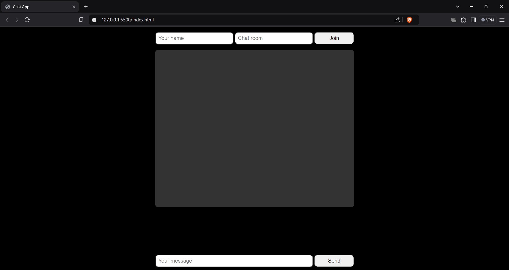
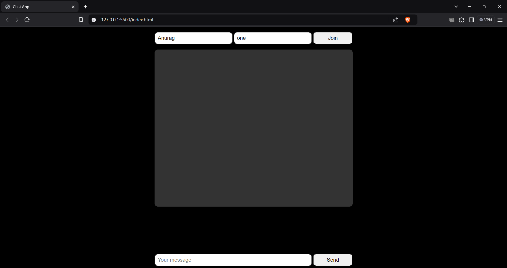

# Beginner Chat App Project

**Name**: Anurag Ganesh Tiwari

**Company**: CODTECH IT SOLUTIONS PVT.LTD

**ID**: CT08DQL

**Domain**: Frontend Web Development

**Duration**: Dec 12th 2024 to Jan 12th 2025

**Mentor**: [Mentor Name]

## Overview of the Project

**Project**: Real-Time Chat Application  

## Objective

The goal of this project is to develop a basic chat application where users can send and receive messages in real-time. This application is intended for beginners to learn about web development concepts, including handling user input, updating the UI dynamically, and implementing WebSocket or similar real-time communication features.

## Key Features

- **User Authentication**: Simple login system to identify users.
- **Real-time Messaging**: Users can send and receive messages instantly.
- **Message Display**: Messages are displayed in a chat window in real-time with user names.
- **Basic UI**: Clean and simple interface with a message input area and send button.
- **Responsive Design**: Mobile-friendly layout for chat application.

## Technologies Used

- **HTML5**: Structure and layout for the chat app.
- **CSS3**: Styling and responsiveness.
  - Flexbox and Grid for layout.
  - Transitions for smooth UI updates.
  - Simple chat bubbles and message display styles.
- **JavaScript**: Core functionality for user interactions.
  - Handling message sending and receiving.
  - DOM manipulation for updating the chat window.
- **WebSocket (or Socket.io)**: Real-time messaging between users.
- **Libraries/Frameworks**:
  - jQuery for DOM manipulation (optional).
  - Bootstrap for responsive design.
 
    

## Implementation Details

1. **User Interface**:
   - Chat window displaying past messages.
   - Input field for typing messages.
   - Send button to submit messages.
   - Scrollable chat area for seamless viewing of messages.
   - Simple layout with a clear distinction between sent and received messages.

2. **Real-time Messaging**:
   - WebSocket or Socket.io implementation for message exchange between users.
   - Messages are broadcasted to all connected clients.
   - Notification for new messages.

3. **Message Display**:
   - Messages are dynamically updated in the chat window.
   - Each message is associated with the sender’s name and timestamp.
   - The input field clears after sending a message.

4. **Responsive Design**:
   - The application is designed to work across devices (desktop, tablet, mobile).
   - Flexbox and media queries ensure a seamless experience on smaller screens.

## Future Enhancements

- **User Profiles**: Allow users to set a profile picture and display name.
- **Private Messaging**: Enable users to send direct messages to specific people.
- **Group Chats**: Implement the ability for users to create and join group chats.
- **Message History**: Store chat history on a server and retrieve messages on app startup.
- **Typing Indicators**: Show when users are typing a message.
- **Emojis and Media**: Integrate emojis, images, and files into messages.
- **Notifications**: Push notifications for new messages when the app is in the background.
- **User Logout**: Implement logout functionality to end sessions.
